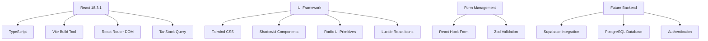
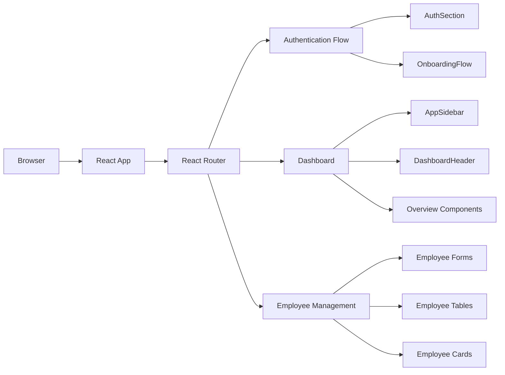

# HR Tech Web App - Technical Documentation

## Table of Contents
1. [System Overview](#system-overview)
2. [Developer Documentation](#developer-documentation)
3. [Deployment & Observability](#deployment--observability)
4. [Security & Performance](#security--performance)
5. [Future Enhancements](#future-enhancements)

---

## System Overview

### Purpose & Scope
This HR tech web application serves as a comprehensive platform for three core functions:

1. **Client Onboarding**: Streamlined authentication and company setup process
2. **Employee Onboarding**: Complete employee registration and management workflow
3. **System of Record**: Centralized employee data and HR operations management

### User Roles & Access Patterns
Currently implemented as a single-tenant application with the following access levels:
- **Admin Users**: Full access to all employee data and system configuration
- **HR Users**: Employee management and onboarding capabilities
- **Future Enhancement**: Role-based access control (RBAC) for multi-tenant scenarios

### Technology Stack



### Architecture Overview



---

## Developer Documentation

### Folder Structure

```
src/
├── components/
│   ├── ui/                     # Shadcn/ui components library
│   │   ├── button.tsx
│   │   ├── input.tsx
│   │   ├── form.tsx
│   │   └── ...
│   ├── AddEmployeeTwoStepForm.tsx  # Employee registration flow
│   ├── AppSidebar.tsx             # Main navigation sidebar
│   ├── AuthSection.tsx            # Authentication UI
│   ├── BrandingSection.tsx        # Landing page branding
│   ├── Dashboard.tsx              # Main dashboard layout
│   ├── DashboardHeader.tsx        # Dashboard header with user menu
│   ├── EmployeeDetailsStep.tsx    # Employee form step 1
│   ├── CompensationReviewStep.tsx # Employee form step 2
│   ├── EmployeeTable.tsx          # Employee data display
│   ├── OnboardingFlow.tsx         # Company setup workflow
│   └── ...
├── data/
│   ├── employees.ts              # Mock employee data
│   └── publicHolidays.ts        # Holiday data
├── hooks/
│   ├── use-toast.ts             # Toast notification hook
│   └── use-mobile.tsx           # Mobile detection hook
├── lib/
│   ├── utils.ts                 # Utility functions
│   └── clientData.ts            # Local storage management
├── pages/
│   ├── Index.tsx                # Main app routing logic
│   ├── NotFound.tsx             # 404 page
│   ├── People.tsx               # Employee management page
│   └── Settings.tsx             # Settings page
├── types/
│   └── employee.ts              # TypeScript interfaces
├── App.tsx                      # Root app component
├── main.tsx                     # App entry point
└── index.css                    # Global styles & design tokens
```

### Key Components

#### Authentication Flow
```typescript
// AuthSection.tsx - Main authentication component
interface AuthSectionProps {
  onSignInComplete: () => void;
  onSignUpComplete: () => void;
}

// Handles sign-in, sign-up, and OTP verification
// Uses react-hook-form with Zod validation
// Supports social login integration
```

#### Employee Management
```typescript
// AddEmployeeTwoStepForm.tsx - Employee registration
interface EmployeeFormData {
  firstName: string;
  lastName: string;
  email: string;
  phone: string;
  jobTitle: string;
  seniorityLevel: string;
  startDate: Date;
  workLocation: string;
  jobDescription?: string;
  salary: number;
  currency: string;
}

// Two-step form with validation and preview
// Step 1: Personal and job details
// Step 2: Compensation and final review
```

#### Navigation & Layout
```typescript
// AppSidebar.tsx - Collapsible sidebar navigation
// Uses Shadcn sidebar component
// Supports icon-only collapsed state
// Active route highlighting with React Router

// Dashboard.tsx - Main layout container
// Integrates sidebar, header, and content area
// Handles routing for dashboard sub-pages
```

### Data Models

#### Employee Interface
```typescript
interface Employee {
  id: string;
  firstName: string;
  lastName: string;
  email: string;
  phone: string;
  jobTitle: string;
  seniorityLevel: 'Junior' | 'Mid-level' | 'Senior' | 'Lead' | 'Manager' | 'Director';
  startDate: string;
  workLocation: 'Remote' | 'Office' | 'Hybrid';
  jobDescription?: string;
  salary: number;
  currency: 'USD' | 'EUR' | 'GBP';
  status: 'Active' | 'Inactive' | 'Pending';
  avatar?: string;
}
```

### State Management
- **Local State**: React useState for component-specific data
- **Form State**: React Hook Form for complex forms with validation
- **Client Data**: LocalStorage for persistent client information
- **Future**: TanStack Query ready for server state management

### Routing Architecture
```typescript
// App.tsx - Main routing configuration
<Routes>
  <Route path="/" element={<Index />} />
  <Route path="/dashboard/*" element={<Index />} />
  <Route path="*" element={<NotFound />} />
</Routes>

// Index.tsx - App state management
// Handles routing between auth, onboarding, and dashboard
// Uses URL-based state determination
```

### Component Patterns

#### Form Components
- Use `react-hook-form` with `@hookform/resolvers/zod`
- Implement proper TypeScript interfaces
- Include loading states and error handling
- Follow Shadcn form patterns

```typescript
const form = useForm<FormData>({
  resolver: zodResolver(schema),
  defaultValues: {...}
});
```

#### UI Components
- All components use Tailwind CSS with semantic tokens
- Leverage Shadcn/ui component library
- Implement dark/light mode support via CSS variables
- Use Lucide React for consistent iconography

---

## Deployment & Observability

### Environment Setup

#### Local Development
```bash
# Prerequisites
- Node.js 18+ 
- npm/yarn/pnpm/bun

# Setup
git clone <repository>
cd hr-tech-app
npm install
npm run dev

# Build
npm run build
npm run preview
```

#### Environment Variables (Future Supabase Integration)
```env
# Supabase Configuration
VITE_SUPABASE_URL=your_supabase_url
VITE_SUPABASE_ANON_KEY=your_supabase_anon_key

# Optional Analytics
VITE_GA_TRACKING_ID=your_google_analytics_id
```

### Production Deployment

#### Static Hosting (Recommended)
```bash
# Build for production
npm run build

# Deploy to platforms:
# - Vercel: vercel deploy
# - Netlify: netlify deploy --prod --dir=dist
# - AWS S3 + CloudFront
# - GitHub Pages
```

#### Vite Configuration
```typescript
// vite.config.ts
export default defineConfig({
  plugins: [react()],
  build: {
    outDir: 'dist',
    sourcemap: true,
    rollupOptions: {
      output: {
        manualChunks: {
          vendor: ['react', 'react-dom'],
          ui: ['@radix-ui/react-dialog', '@radix-ui/react-dropdown-menu']
        }
      }
    }
  }
})
```

### Error Handling & Logging

#### Current Error Patterns
```typescript
// Form validation errors via Zod
// Toast notifications for user feedback
// Console logging for development

// Recommended production logging
try {
  await submitForm(data);
  toast({ title: "Success", description: "Employee added successfully" });
} catch (error) {
  console.error('Form submission error:', error);
  toast({ 
    title: "Error", 
    description: "Failed to add employee",
    variant: "destructive" 
  });
}
```

#### Analytics Integration Points
```typescript
// User interactions to track:
// - Authentication events
// - Employee creation/updates
// - Navigation patterns
// - Form completion rates
// - Error occurrences

// Example implementation:
const trackEvent = (event: string, properties: object) => {
  // Google Analytics, Mixpanel, or custom analytics
  gtag('event', event, properties);
};
```

### Performance Monitoring

#### Optimization Strategies
- **Code Splitting**: Implement route-based code splitting
- **Lazy Loading**: Load heavy components on demand
- **Bundle Analysis**: Use `vite-bundle-analyzer`
- **Image Optimization**: Implement next-gen image formats
- **Caching**: Configure appropriate cache headers

#### Performance Metrics to Monitor
- **Core Web Vitals**: LCP, FID, CLS
- **Bundle Size**: Track chunk sizes over time
- **Load Times**: Initial page load and route transitions
- **Error Rates**: Client-side error tracking

---

## Security & Performance

### Frontend Security Considerations
- **Input Validation**: All form inputs validated with Zod schemas
- **XSS Prevention**: React's built-in protection + proper data sanitization
- **CSRF Protection**: Implement when adding API endpoints
- **Authentication**: Secure token storage and session management
- **Data Privacy**: Implement data encryption for sensitive information

### Performance Optimization
```typescript
// Lazy loading for route components
const Dashboard = lazy(() => import('./pages/Dashboard'));
const People = lazy(() => import('./pages/People'));

// Memoization for expensive computations
const MemoizedEmployeeTable = memo(EmployeeTable);

// Virtual scrolling for large datasets
// Implement when employee list grows beyond 100 items
```

---

## Future Enhancements

### Supabase Integration Roadmap

#### Phase 1: Authentication
```sql
-- User authentication table
CREATE TABLE profiles (
  id uuid REFERENCES auth.users PRIMARY KEY,
  email text UNIQUE NOT NULL,
  full_name text,
  role text DEFAULT 'user',
  created_at timestamp DEFAULT now()
);
```

#### Phase 2: Employee Management
```sql
-- Employee data table
CREATE TABLE employees (
  id uuid DEFAULT gen_random_uuid() PRIMARY KEY,
  first_name text NOT NULL,
  last_name text NOT NULL,
  email text UNIQUE NOT NULL,
  phone text,
  job_title text NOT NULL,
  seniority_level text NOT NULL,
  start_date date NOT NULL,
  work_location text NOT NULL,
  job_description text,
  salary decimal,
  currency text DEFAULT 'USD',
  status text DEFAULT 'Active',
  created_by uuid REFERENCES profiles(id),
  created_at timestamp DEFAULT now(),
  updated_at timestamp DEFAULT now()
);
```

#### Phase 3: Role-Based Access Control
```sql
-- RLS policies for multi-tenant support
ALTER TABLE employees ENABLE ROW LEVEL SECURITY;

CREATE POLICY "Users can view employees in their organization" 
ON employees FOR SELECT 
USING (organization_id = get_user_organization());
```

### API Integration Patterns
```typescript
// Supabase client setup
import { createClient } from '@supabase/supabase-js';

const supabase = createClient(
  process.env.VITE_SUPABASE_URL!,
  process.env.VITE_SUPABASE_ANON_KEY!
);

// Employee service layer
export const employeeService = {
  async create(employee: CreateEmployeeRequest) {
    const { data, error } = await supabase
      .from('employees')
      .insert(employee)
      .select();
    
    if (error) throw error;
    return data[0];
  },
  
  async list(filters?: EmployeeFilters) {
    let query = supabase.from('employees').select('*');
    
    if (filters?.status) {
      query = query.eq('status', filters.status);
    }
    
    const { data, error } = await query;
    if (error) throw error;
    return data;
  }
};
```

### Testing Strategy
```typescript
// Unit testing with Vitest
// Component testing with React Testing Library
// E2E testing with Playwright

// Example test structure:
describe('AddEmployeeTwoStepForm', () => {
  it('validates required fields', async () => {
    render(<AddEmployeeTwoStepForm />);
    
    const submitButton = screen.getByRole('button', { name: /submit/i });
    fireEvent.click(submitButton);
    
    expect(screen.getByText(/first name is required/i)).toBeInTheDocument();
  });
});
```

---

## Contributing Guidelines

### Code Standards
- **TypeScript**: Strict mode enabled, proper type definitions
- **ESLint**: Configured with React and TypeScript rules
- **Prettier**: Code formatting consistency
- **Component Structure**: Functional components with hooks
- **Naming Conventions**: PascalCase for components, camelCase for functions

### Development Workflow
1. Create feature branch from `main`
2. Implement changes with proper TypeScript types
3. Add/update tests for new functionality
4. Update documentation if needed
5. Submit PR with clear description
6. Code review and approval required
7. Merge to `main` and deploy

### Best Practices
- Keep components focused and single-responsibility
- Use custom hooks for complex logic
- Implement proper error boundaries
- Follow accessibility guidelines (WCAG 2.1)
- Optimize for performance (memoization, lazy loading)
- Write comprehensive tests for critical paths

---

*This documentation is maintained alongside the codebase and should be updated with any architectural changes or new features.*